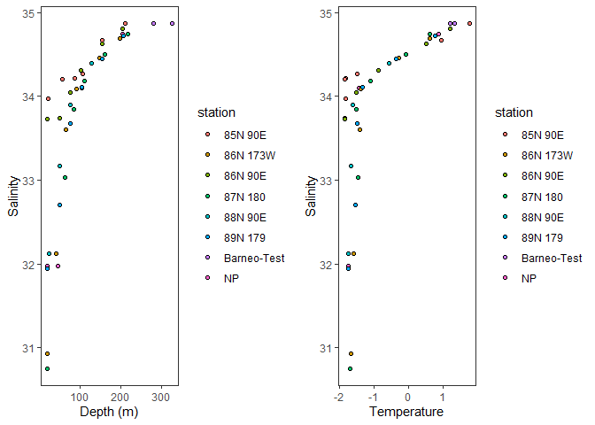

Bottle data
================
Sam Bashevkin
Nov 05 2019

# Introduction

Load data

``` r
d<-read_csv("~/NCEAS training/NPEO2010BottleData.csv")
```

How does salinity vary among stations? Which station is the saltiest and
which has the most variable salinity?

# Analysis

Plot salinity vs depth curves for selected stations.

    ## Warning: Removed 2 rows containing missing values (geom_point).
    
    ## Warning: Removed 2 rows containing missing values (geom_point).

<!-- -->

Summarise salinity for each station

``` r
dsal<-d%>%
  group_by(station)%>%
  summarise(Salinity=mean(salinity_A, na.rm=T), Salinity_sd=sd(salinity_A, na.rm=T))

dsal
```

    ## # A tibble: 8 x 3
    ##   station     Salinity Salinity_sd
    ##   <chr>          <dbl>       <dbl>
    ## 1 85N 90E         34.4    0.331   
    ## 2 86N 173W        33.3    1.48    
    ## 3 86N 90E         34.2    0.453   
    ## 4 87N 180         33.5    1.48    
    ## 5 88N 90E         33.0    1.01    
    ## 6 89N 179         33.6    1.08    
    ## 7 Barneo-Test     34.9    0.000212
    ## 8 NP              33.2    1.44

# Results

Salinity ranges from 30.7571 to 34.867. Barneo-Test is the saltiest
station and 88N 90E is the freshest station. 86N 173W has the most
variable salinity and Barneo-Test has the least variable salinity.
